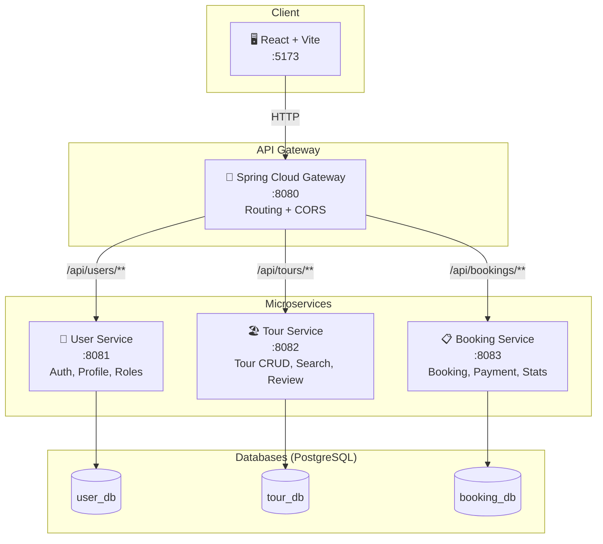
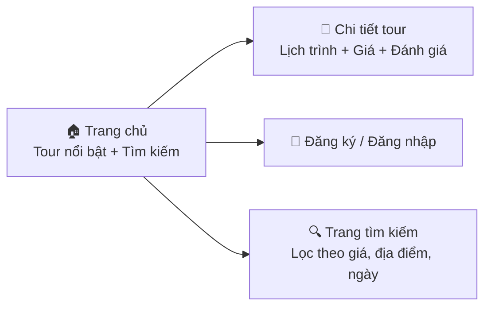
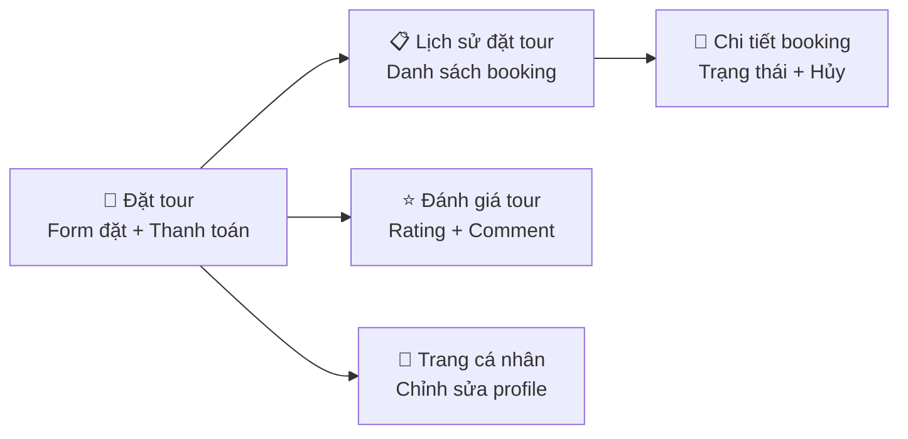
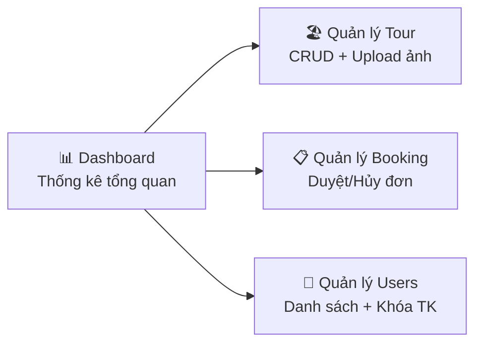
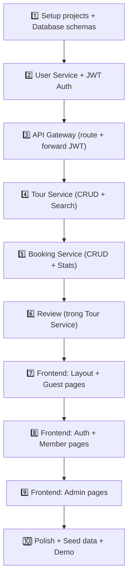

# Website Bán Tour Du Lịch — Kế Hoạch Triển Khai Chi Tiết

## Tổng Quan

| Mục | Chi tiết |
|-----|---------|
| **Đề tài** | Website Bán Tour Du Lịch |
| **Kiến trúc** | Microservice (Web App 3) |
| **Backend** | Java Spring Boot 3.x × 4 projects |
| **Frontend** | React + Vite × 1 project |
| **Database** | PostgreSQL (shared server, mỗi service 1 schema riêng) |
| **Team** | 1 người |
| **Trình độ** | Mới học → Plan thiết kế hợp lý, có hướng dẫn từng bước |

---

## Kiến Trúc Hệ Thống



> [!NOTE]
> **Tại sao cần API Gateway?** Vì frontend chỉ gọi đến 1 địa chỉ duy nhất (`:8080`), Gateway tự route đến đúng service. Điều này cũng giải quyết vấn đề CORS và giúp quản lý JWT token tập trung.

---

## Database Schema

### 📦 Schema 1: `user_db` (User Service)

```sql
CREATE DATABASE user_db;
\c user_db;

CREATE TABLE users (
    id          BIGSERIAL PRIMARY KEY,
    email       VARCHAR(100) NOT NULL UNIQUE,
    password    VARCHAR(255) NOT NULL,
    full_name   VARCHAR(100) NOT NULL,
    phone       VARCHAR(20),
    avatar_url  VARCHAR(500),
    role        VARCHAR(10) NOT NULL DEFAULT 'MEMBER'
                CHECK (role IN ('GUEST', 'MEMBER', 'ADMIN')),
    is_active   BOOLEAN DEFAULT TRUE,
    created_at  TIMESTAMP DEFAULT CURRENT_TIMESTAMP,
    updated_at  TIMESTAMP DEFAULT CURRENT_TIMESTAMP
);

-- Seed admin account
INSERT INTO users (email, password, full_name, role)
VALUES ('admin@tourapp.com', '$2a$10$...hashedpassword...', 'Administrator', 'ADMIN');
```

---

### 📦 Schema 2: `tour_db` (Tour Service)

```sql
CREATE DATABASE tour_db;
\c tour_db;

-- Danh mục địa điểm
CREATE TABLE destinations (
    id          BIGSERIAL PRIMARY KEY,
    name        VARCHAR(100) NOT NULL,        -- 'Đà Nẵng', 'Phú Quốc'
    description TEXT,
    image_url   VARCHAR(500),
    created_at  TIMESTAMP DEFAULT CURRENT_TIMESTAMP
);

-- Tour du lịch
CREATE TABLE tours (
    id              BIGSERIAL PRIMARY KEY,
    title           VARCHAR(200) NOT NULL,        -- 'Tour Đà Nẵng - Hội An 3N2Đ'
    description     TEXT,
    destination_id  BIGINT NOT NULL REFERENCES destinations(id),
    duration_days   INT NOT NULL,                 -- Số ngày
    max_participants INT NOT NULL,                -- Số người tối đa
    price_adult     NUMERIC(12,0) NOT NULL,       -- Giá người lớn (VNĐ)
    price_child     NUMERIC(12,0),                -- Giá trẻ em
    thumbnail_url   VARCHAR(500),
    start_date      DATE NOT NULL,
    end_date        DATE NOT NULL,
    is_active       BOOLEAN DEFAULT TRUE,
    created_at      TIMESTAMP DEFAULT CURRENT_TIMESTAMP,
    updated_at      TIMESTAMP DEFAULT CURRENT_TIMESTAMP
);

-- Hình ảnh tour (nhiều ảnh cho 1 tour)
CREATE TABLE tour_images (
    id          BIGSERIAL PRIMARY KEY,
    tour_id     BIGINT NOT NULL REFERENCES tours(id) ON DELETE CASCADE,
    image_url   VARCHAR(500) NOT NULL,
    caption     VARCHAR(200),
    sort_order  INT DEFAULT 0
);

-- Lịch trình tour (ngày 1, ngày 2, ...)
CREATE TABLE tour_schedules (
    id          BIGSERIAL PRIMARY KEY,
    tour_id     BIGINT NOT NULL REFERENCES tours(id) ON DELETE CASCADE,
    day_number  INT NOT NULL,                     -- Ngày thứ mấy
    title       VARCHAR(200),                     -- 'Khám phá Bà Nà Hills'
    description TEXT
);

-- Đánh giá tour
CREATE TABLE reviews (
    id          BIGSERIAL PRIMARY KEY,
    tour_id     BIGINT NOT NULL REFERENCES tours(id) ON DELETE CASCADE,
    user_id     BIGINT NOT NULL,                  -- ID từ User Service
    rating      INT NOT NULL CHECK (rating BETWEEN 1 AND 5),
    comment     TEXT,
    created_at  TIMESTAMP DEFAULT CURRENT_TIMESTAMP
);
```

---

### 📦 Schema 3: `booking_db` (Booking Service)

```sql
CREATE DATABASE booking_db;
\c booking_db;

CREATE TABLE bookings (
    id              BIGSERIAL PRIMARY KEY,
    booking_code    VARCHAR(20) NOT NULL UNIQUE,  -- 'BK-20261001-001'
    user_id         BIGINT NOT NULL,              -- ID từ User Service
    tour_id         BIGINT NOT NULL,              -- ID từ Tour Service
    num_adults      INT NOT NULL DEFAULT 1,
    num_children    INT DEFAULT 0,
    total_price     NUMERIC(15,0) NOT NULL,
    contact_name    VARCHAR(100) NOT NULL,
    contact_phone   VARCHAR(20) NOT NULL,
    contact_email   VARCHAR(100),
    special_request TEXT,
    status          VARCHAR(15) NOT NULL DEFAULT 'PENDING'
                    CHECK (status IN ('PENDING', 'CONFIRMED', 'CANCELLED', 'COMPLETED')),
    payment_method  VARCHAR(15) NOT NULL DEFAULT 'CASH'
                    CHECK (payment_method IN ('CASH', 'BANK_TRANSFER', 'MOMO')),
    payment_status  VARCHAR(10) NOT NULL DEFAULT 'UNPAID'
                    CHECK (payment_status IN ('UNPAID', 'PAID', 'REFUNDED')),
    created_at      TIMESTAMP DEFAULT CURRENT_TIMESTAMP,
    updated_at      TIMESTAMP DEFAULT CURRENT_TIMESTAMP
);
```

---

## API Endpoints

### 🔐 User Service (`:8081`)

| Method | Endpoint | Role | Mô tả |
|--------|----------|------|--------|
| POST | `/api/users/register` | PUBLIC | Đăng ký tài khoản |
| POST | `/api/users/login` | PUBLIC | Đăng nhập → trả JWT token |
| GET | `/api/users/me` | MEMBER+ | Lấy thông tin cá nhân |
| PUT | `/api/users/me` | MEMBER+ | Cập nhật profile |
| GET | `/api/users` | ADMIN | Danh sách tất cả users |
| PUT | `/api/users/{id}/status` | ADMIN | Khóa/mở khóa tài khoản |
| GET | `/api/users/{id}` | ADMIN | Xem chi tiết 1 user |

### 🏖️ Tour Service (`:8082`)

| Method | Endpoint | Role | Mô tả |
|--------|----------|------|--------|
| GET | `/api/tours` | PUBLIC | Danh sách tour (có phân trang, lọc) |
| GET | `/api/tours/{id}` | PUBLIC | Chi tiết 1 tour |
| GET | `/api/tours/search?keyword=&dest=&minPrice=&maxPrice=` | PUBLIC | Tìm kiếm tour |
| POST | `/api/tours` | ADMIN | Tạo tour mới |
| PUT | `/api/tours/{id}` | ADMIN | Cập nhật tour |
| DELETE | `/api/tours/{id}` | ADMIN | Xóa tour |
| GET | `/api/destinations` | PUBLIC | Danh sách điểm đến |
| POST | `/api/destinations` | ADMIN | Thêm điểm đến |
| GET | `/api/tours/{id}/reviews` | PUBLIC | Xem đánh giá tour |
| POST | `/api/tours/{id}/reviews` | MEMBER | Viết đánh giá |

### 📋 Booking Service (`:8083`)

| Method | Endpoint | Role | Mô tả |
|--------|----------|------|--------|
| POST | `/api/bookings` | MEMBER | Đặt tour mới |
| GET | `/api/bookings/my` | MEMBER | Lịch sử booking của tôi |
| GET | `/api/bookings/my/{id}` | MEMBER | Chi tiết 1 booking của tôi |
| PUT | `/api/bookings/my/{id}/cancel` | MEMBER | Hủy booking |
| GET | `/api/bookings` | ADMIN | Tất cả bookings |
| PUT | `/api/bookings/{id}/status` | ADMIN | Duyệt/hủy booking |
| GET | `/api/bookings/stats` | ADMIN | Thống kê doanh thu |
| GET | `/api/bookings/stats/monthly` | ADMIN | Doanh thu theo tháng |

---

## 3 Nhóm Người Dùng & Màn Hình

### 👤 GUEST (Không đăng nhập) — 3 màn hình



### 👥 MEMBER (Thành viên) — 3+ màn hình



### 🛡️ ADMIN (Quản trị) — 3+ màn hình



---

## Cấu Trúc Thư Mục Dự Án

```
c:\Study\HK1Nam3\J2EE\Project\
│
├── api-gateway/                          # Spring Cloud Gateway
│   ├── src/main/java/com/tourapp/gateway/
│   │   └── ApiGatewayApplication.java
│   ├── src/main/resources/
│   │   └── application.yml               # Route config
│   └── pom.xml
│
├── user-service/                          # Spring Boot
│   ├── src/main/java/com/tourapp/user/
│   │   ├── UserServiceApplication.java
│   │   ├── controller/
│   │   │   └── UserController.java
│   │   ├── service/
│   │   │   └── UserService.java
│   │   ├── repository/
│   │   │   └── UserRepository.java
│   │   ├── model/
│   │   │   └── User.java
│   │   ├── dto/
│   │   │   ├── LoginRequest.java
│   │   │   ├── RegisterRequest.java
│   │   │   └── UserResponse.java
│   │   └── security/
│   │       ├── JwtUtil.java
│   │       └── SecurityConfig.java
│   ├── src/main/resources/
│   │   └── application.yml
│   └── pom.xml
│
├── tour-service/                          # Spring Boot
│   ├── src/main/java/com/tourapp/tour/
│   │   ├── TourServiceApplication.java
│   │   ├── controller/
│   │   │   ├── TourController.java
│   │   │   ├── DestinationController.java
│   │   │   └── ReviewController.java
│   │   ├── service/
│   │   ├── repository/
│   │   ├── model/
│   │   │   ├── Tour.java
│   │   │   ├── Destination.java
│   │   │   ├── TourImage.java
│   │   │   ├── TourSchedule.java
│   │   │   └── Review.java
│   │   └── dto/
│   ├── src/main/resources/
│   │   └── application.yml
│   └── pom.xml
│
├── booking-service/                       # Spring Boot
│   ├── src/main/java/com/tourapp/booking/
│   │   ├── BookingServiceApplication.java
│   │   ├── controller/
│   │   │   └── BookingController.java
│   │   ├── service/
│   │   ├── repository/
│   │   ├── model/
│   │   │   └── Booking.java
│   │   └── dto/
│   ├── src/main/resources/
│   │   └── application.yml
│   └── pom.xml
│
└── frontend/                              # React + Vite
    ├── src/
    │   ├── main.jsx
    │   ├── App.jsx
    │   ├── api/
    │   │   └── axiosClient.js             # Axios config → :8080
    │   ├── context/
    │   │   └── AuthContext.jsx            # JWT state management
    │   ├── pages/
    │   │   ├── guest/
    │   │   │   ├── HomePage.jsx
    │   │   │   ├── TourDetailPage.jsx
    │   │   │   ├── SearchPage.jsx
    │   │   │   └── LoginPage.jsx
    │   │   ├── member/
    │   │   │   ├── BookingPage.jsx
    │   │   │   ├── MyBookingsPage.jsx
    │   │   │   ├── BookingDetailPage.jsx
    │   │   │   ├── ReviewPage.jsx
    │   │   │   └── ProfilePage.jsx
    │   │   └── admin/
    │   │       ├── DashboardPage.jsx
    │   │       ├── ManageToursPage.jsx
    │   │       ├── ManageBookingsPage.jsx
    │   │       └── ManageUsersPage.jsx
    │   ├── components/
    │   │   ├── layout/
    │   │   │   ├── Navbar.jsx
    │   │   │   ├── Footer.jsx
    │   │   │   └── AdminSidebar.jsx
    │   │   ├── tour/
    │   │   │   ├── TourCard.jsx
    │   │   │   └── TourFilter.jsx
    │   │   └── common/
    │   │       ├── ProtectedRoute.jsx
    │   │       ├── LoadingSpinner.jsx
    │   │       └── StarRating.jsx
    │   └── styles/
    │       └── index.css
    ├── index.html
    ├── vite.config.js
    └── package.json
```

---

## Tech Stack Chi Tiết

| Layer | Công nghệ | Lý do |
|-------|-----------|-------|
| **Frontend** | React 18 + Vite | Nhanh, nhẹ, dễ học |
| **Routing** | React Router DOM v6 | SPA routing chuẩn |
| **HTTP Client** | Axios | Dễ config JWT interceptor |
| **UI Library** | Ant Design hoặc CSS thuần | Ant Design cho UI đẹp nhanh |
| **Backend** | Spring Boot 3.2+ | Yêu cầu đề bài |
| **ORM** | Spring Data JPA + Hibernate | Chuẩn Java enterprise |
| **Security** | Spring Security + JWT (jjwt) | Phân quyền 3 roles |
| **Gateway** | Spring Cloud Gateway | Route requests giữa services |
| **Database** | PostgreSQL 16 | Mạnh mẽ, hỗ trợ JSON, full-text search tốt |
| **Build** | Maven | Chuẩn cho Spring Boot |

---

## Timeline Chi Tiết (1 Người Làm, ~10 Tuần)

### Phase 1: Foundation (Tuần 3-5) — 3 tuần

| Ngày | Công việc | Chi tiết |
|------|-----------|---------|
| T3-W1 | Setup tất cả projects | Tạo 4 Spring Boot + 1 React project |
| T3-W1 | Database | Tạo 3 database schemas, seed data mẫu |
| T4-W1 | **User Service** | Entity, Repository, Service, Controller |
| T4-W2 | JWT Auth | JwtUtil, SecurityConfig, Login/Register |
| T5-W1 | **API Gateway** | Route config, CORS, forward JWT header |
| T5-W2 | Test Phase 1 | Postman test đăng ký, đăng nhập, token |

### Phase 2: Core Features (Tuần 6-8) — 3 tuần

| Ngày | Công việc | Chi tiết |
|------|-----------|---------|
| T6-W1 | **Tour Service** - Model | Entity: Tour, Destination, Image, Schedule |
| T6-W2 | **Tour Service** - CRUD | API: list, detail, create, update, delete |
| T7-W1 | **Tour Service** - Search | Tìm kiếm, lọc, phân trang |
| T7-W2 | **Booking Service** | Đặt tour, lịch sử, hủy, duyệt |
| T8-W1 | Review + Stats | Đánh giá tour + Dashboard thống kê |
| T8-W2 | Test Phase 2 | Postman test toàn bộ API |

### Phase 3: Frontend (Tuần 9-11) — 3 tuần

| Ngày | Công việc | Chi tiết |
|------|-----------|---------|
| T9-W1 | Setup React | Axios, Router, AuthContext, Layout |
| T9-W2 | Guest pages | Trang chủ, Chi tiết tour, Tìm kiếm |
| T10-W1 | Auth + Member | Login/Register, Đặt tour, Lịch sử |
| T10-W2 | Member pages | Chi tiết booking, Đánh giá, Profile |
| T11-W1 | Admin pages | Dashboard, Quản lý Tour, Booking, User |
| T11-W2 | Styling + Polish | Responsive, animations, UX |

### Phase 4: Finish (Tuần 12-14) — 3 tuần

| Ngày | Công việc | Chi tiết |
|------|-----------|---------|
| T12 | Seed data đẹp | 10-15 tour thật với hình ảnh |
| T12 | Bug fixing | Test end-to-end, fix lỗi |
| T13 | Demo prep | Chuẩn bị demo scenario |
| T14 | **NỘP BÀI + BÁO CÁO** | 🎉 |

---

## Thứ Tự Xây Dựng (Quan Trọng!)

> [!IMPORTANT]
> **Làm theo đúng thứ tự này để tránh bị stuck:**



---

## Giao Tiếp Giữa Các Services

> [!NOTE]
> Khi Booking Service cần lấy thông tin tour (giá, tên), nó sẽ gọi REST API sang Tour Service. Đây là cách đơn giản nhất cho người mới.

```java
// Trong Booking Service - gọi sang Tour Service để lấy giá tour
@Service
public class BookingService {
    
    private final RestTemplate restTemplate;
    
    // Gọi Tour Service nội bộ (không qua Gateway)
    public TourResponse getTourInfo(Long tourId) {
        String url = "http://localhost:8082/api/tours/" + tourId;
        return restTemplate.getForObject(url, TourResponse.class);
    }
}
```

---

## Verification Plan

### Automated Tests
- Mỗi service có Postman collection test tất cả endpoints
- `mvn test` cho unit tests cơ bản

### Manual Verification
- **Luồng Guest**: Vào trang chủ → Xem tour → Tìm kiếm → Đăng ký
- **Luồng Member**: Đăng nhập → Đặt tour → Xem lịch sử → Hủy → Đánh giá
- **Luồng Admin**: Đăng nhập admin → Tạo tour → Duyệt booking → Xem thống kê
- Chạy đồng thời 4 Spring Boot services + 1 React dev server

---

## Bắt Đầu Từ Đâu?

Khi bạn approve plan này, tôi sẽ giúp bạn **từng bước một**:

1. ✅ Tạo tất cả Spring Boot projects (Maven, dependencies)
2. ✅ Tạo React + Vite project  
3. ✅ Setup database schemas
4. ✅ Code User Service + JWT
5. ✅ Và tiếp tục cho đến hoàn thiện...

> [!NOTE]
> **Lưu ý cho 1 người làm**: Plan này đã được thiết kế để 1 người có thể hoàn thành trong 10 tuần. Ưu tiên hoàn thành 3 service chính (User, Tour, Booking) + API Gateway + Frontend trước. **Notification Service sẽ được bổ sung sau khi xong các phần chính.**
